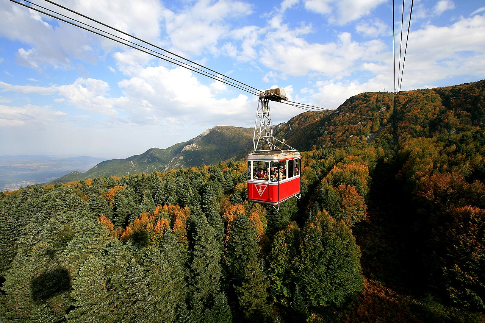

# 📍 Bursa - Seyahat ve Tefekkür Notları

## 📜 Şehrin Ruhu
> "Dağın yüceliği sadece zirvesindeki karlardan değil, eteklerindeki çınarlara verdiği can suyundan gelir."
> "Suyun sesine karışan ulu çınar yapraklarının, bir imparatorluğun doğuşuna beşiklik ettiği yeşil başkent."

### 🌍 Şehrin Dokusu ve Hatırası
Uludağ'ın eteklerine şefkatle yaslanmış, yeşiliyle ve suyuyla her nefeste hayat bulan asil Osmanlı şehri. Her köşebaşındaki tarihi bir şadırvandan su sesi gelir; dar sokaklarında ahşap ve taşlarla ilmek ilmek işlenmiş, asırlara meydan okuyan bir sükunet vardır.

Bursa, doğa ile insanın, yeşil ile mimarinin en zarif şekilde uyumlandığı kadim bir huzur yuvasıdır. Hanlar bölgesindeki çay molaları, zamanın burada daha yavaş aktığının en büyük kanıtıdır.

Ulu Cami'nin o bitimsiz, iç içe geçmiş yirmi kubbesi altında duyulan yankı, Yeşil Türbe'nin sır kaplı çinilerindeki ince işçilik ve Kozahan'da ipek tezgâhlarından yükselen o kadim şıkırtılar... Bursa, sadece eski bir başkent değil, toprağın suyla, sanatın inançla buluşup mayalandığı, ruhu hiçbir zaman eskimemiş yeşil bir cennettir.

### 🕊️ Gezginin Not Defterinden (İçsel Düşünceler)
Tarihi İnkaya çınarının altında kök salmak ve göğe yükselmek üzerine düşünmek, insana sabrın gücünü öğretir. Bursa, ne kadar büyürse büyüsün, o ilk toprağa düşen Osman Gazi tohumunun tevazusunu hep koruması gerektiğini sessizce anlatır.

Ulu Cami'nin şadırvanından dökülen her damla su, insanın kendi günahlarından ve kibrinden arınması, berraklaşması için yapılmış bir çağrıdır. Emir Sultan'ın tepesinden şehre bakıldığında, hayatın ne kadar da gelip geçici, dünyevi telaşların ne kadar beyhude olduğu bir kez daha, suyun ve yeşilin fısıltısıyla ruhun en derinliklerine kazınır.

### 🍽️ Yöresel Lezzet Tavsiyeleri
- **Tarihi İskender Kebap:** Pide, tereyağı, enfes döner ve salçanın 1800'lerden gelen büyük buluşması.
- **Pideli Köfte:** Kayhan çarşısında esnafın en sevdiği, iskenderin mütevazı ama bir o kadar lezzetli kardeşi.
- **Tahinli Pide:** Sabahın erken saatlerinde fırından yeni çıkmış, çayın en büyük yoldaşı.

### ⛺ Konaklama ve Bütçe Stratejisi
- **Sıfır Konaklama Maliyeti:** GSB Seyahatsever projesi kapsamında şehirdeki KYK yurtlarında 5 gün ücretsiz konaklanmıştır.
- **Ulaşım Optimizasyonu:** Bir önceki ilden rotaya devam edilerek yol masrafı minimize edilmiştir.

### 💻 Yarı Göçebe Mesaisi (Upskilling)
- **Kütüphane Rutini:** Gündüzleri İl Halk Kütüphanesinde zaman geçirilerek yazılım projeleri geliştirilmiş ve eğitimlere devam edilmiştir.
- **Şehri Sindirme:** Kalan vakitlerde şehrin tarihi ve kültürel dokusu acele etmeden, derinlemesine keşfedilmiştir.

### ✨ Keşfedilesi Duraklar
Bu şehrin havasını solumak, ruhuna dokunmak için mutlaka adımlanması gereken köşe taşları:
- [ ] **Ulu Cami**
- [ ] **Tarihi İnkaya Çınarı**
- [ ] **Yeşil Türbe**
- [ ] **Koza Han**
- [ ] **Cumalıkızık**
- [ ] **Tophane**
- [ ] **Osman Gazi ve Orhan Gazi Türbeleri**

---
*Bu il bizzat deneyimlenmiş, yolları aşındırılmış ve seyahatnameye sevgiyle işlenmiştir.* ✅
