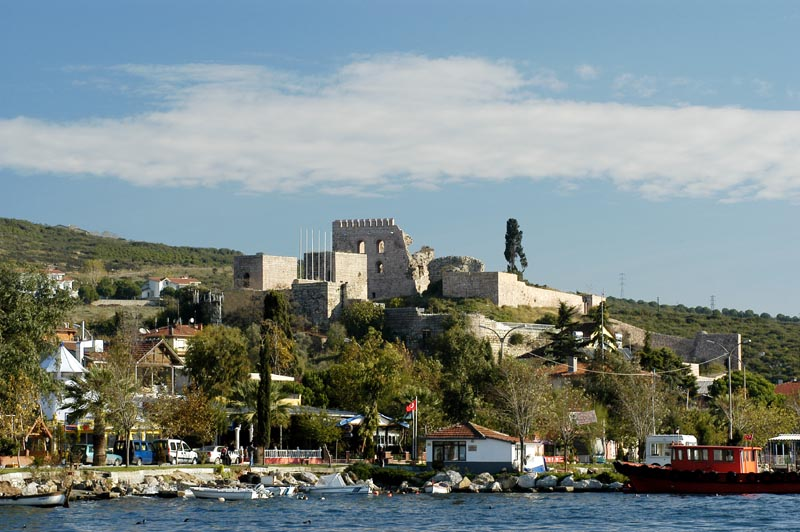

# 📍 Kocaeli - Seyahat ve Tefekkür Notları

## 📜 Şehrin Ruhu
> "Emeğin teriyle işlediği demir pas tutmaz; yorgunluk, yeni bir inşanın umut kıvılcımıdır."
> "Fabrika bacalarından tüten isli umutlarla, bitinya krallığından kalma mirasın beraber yeşerdiği üretim diyarı."

### 🌍 Şehrin Dokusu ve Hatırası
Denizin kıyısında, körfez köprülerinin ağzında, demirin, plastiğin ve ateşin şekillendiği Türkiye'nin devasa endüstri başkenti. Dışarıdan veya otobandan bakıldığında sadece sanayi bacaları ve duman görünse de, şehrin biraz içine sızınca Kartepe'nin karlarına ve Kandıra'nın yemyeşil koylarına ulaşırsınız.

Kocaeli, gece gündüz uyumayan bir üretim arzusuyla, dağların arkasındaki gizli doğanın sürekli bir mücadele ve denge içinde yaşadığı, dinamik bir şehirdir.

Eskihisar sahilinden Yalova'ya doğru uzanan vapur rotasında martılara simit atarken, bir tarafınızda Osman Hamdi Bey'in Kaplumbağa Terbiyecisi'ni çizdiği tarihi konağı, diğer tarafınızda yüzlerce metre boyunda devasa lojistik gemilerini görürsünüz. Bu şehir, sanayi ile kültürün, beton ile doğanın o garip, bitirim ve eşsiz sarmalıdır.

### 🕊️ Gezginin Not Defterinden (İçsel Düşünceler)
Çarkların, çekiçlerin ve koca fabrikaların geceyi aydınlatan ateşli sesi, aslında insan aklının, hayatta kalma refleksinin ve emeğinin birer senfonisidir. Hiçbir şey durduk yere şekillenmez; demir bile işe yaramak için önce ateşe sabırla dayanmalıdır.

Bu isli ve dumanlı fabrikaların gölgesinde bile insanın umuda olan inancından hiçbir şey kaybetmemesi, üretmenin ve alın terinin ne kadar kutsal bir arınma yöntemi olduğunu anlatır. Tüketimin çılgınlığına karşı, Kocaeli usulca 'gerçek zafer, bir şeyler üretebildiğinde başlar' mesajını verir.

### 🍽️ Yöresel Lezzet Tavsiyeleri
- **Pişmaniye:** Çekildikçe incelen, ustalık isteyen ve damakta eriyen tatlı tel tel Kar demeti.
- **Değirmendere Fındığı / Yarımca Kirazı:** Endüstrinin tam kalbinden fışkıran yöresel doğa mucizeleri.
- **Kandıra Yoğurdu:** Manda sütünden yapılan, bıçakla kesilebilecek kadar kıvamlı ve doğal yoğurt.

### ⛺ Konaklama ve Bütçe Stratejisi
- **Sıfır Konaklama Maliyeti:** GSB Seyahatsever projesi kapsamında şehirdeki KYK yurtlarında 5 gün ücretsiz konaklanmıştır.
- **Ulaşım Optimizasyonu:** Bir önceki ilden rotaya devam edilerek yol masrafı minimize edilmiştir.

### 💻 Yarı Göçebe Mesaisi (Upskilling)
- **Kütüphane Rutini:** Gündüzleri İl Halk Kütüphanesinde zaman geçirilerek yazılım projeleri geliştirilmiş ve eğitimlere devam edilmiştir.
- **Şehri Sindirme:** Kalan vakitlerde şehrin tarihi ve kültürel dokusu acele etmeden, derinlemesine keşfedilmiştir.

### ✨ Keşfedilesi Duraklar
Bu şehrin havasını solumak, ruhuna dokunmak için mutlaka adımlanması gereken köşe taşları:
- [ ] **Sekapark (Eski Kağıt Fabrikası Dönüşümü)**
- [ ] **Kartepe Kayak Merkezi**
- [ ] **İzmit Tarihi Saat Kulesi**
- [ ] **Osman Hamdi Bey Evi (Eskihisar)**
- [ ] **Kefken ve Kerpe Kayalıkları**
- [ ] **Ormanya Doğal Yaşam Parkı**

---
*Bu il bizzat deneyimlenmiş, yolları aşındırılmış ve seyahatnameye sevgiyle işlenmiştir.* ✅
