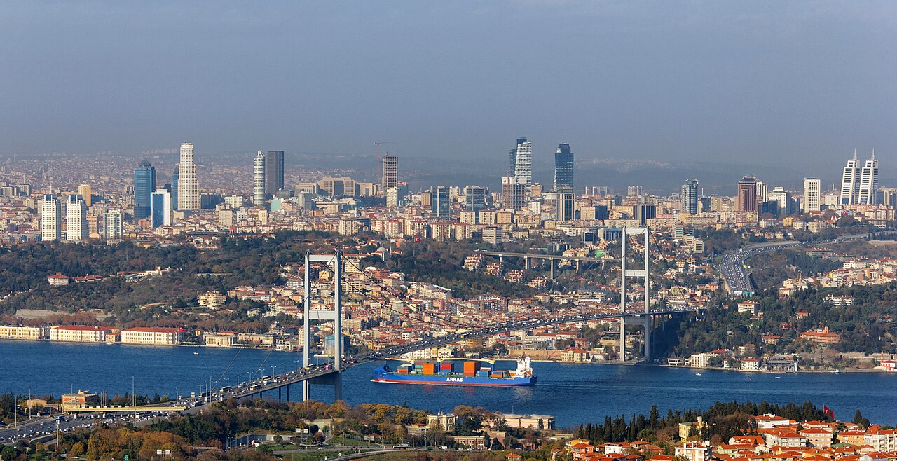

# 📍 İstanbul - Seyahat ve Tefekkür Notları

## 📜 Şehrin Ruhu
> "İstanbul bir ayna gibidir; ona yüzünü dönen, zamanın ve tarihin kalbinde kendi yansımasını görür."
> "İmparatorlukların ebediyete karıştığı, taşın ve denizin şiir yazdığı yedi tepeli masal."

### 🌍 Şehrin Dokusu ve Hatırası
Dünyanın gözbebeği, iki kıtayı birbirine diken asırlık payitaht. Topraklarında barındırdığı üç büyük imparatorluğun kültürel ve mimari nefesini her sokağında hissettiren bu kadim şehir, asla uyumayan devasa bir deryadır.

Ayasofya'nın kubbesinden süzülen solgun bir ışık, Galata'nın rutubetli taşlarına sinmiş anılar, Boğaz'ın hırçın rüzgarına karışan eski zaman fısıltıları... İstanbul, dar vakitlerde aceleyle 'gezilecek' değil; durup uzun uzadıya kulak verilecek, derin bir nefesle içe çekilecek, insanın kendi varoluşunu sorgulayabileceği uçsuz bucaksız bir romandır.

Yedi tepesine nakış gibi işlenmiş ulu camileri, yüzyılların hüznünü taşıyan surları, erguvan mevsiminde alev alev yanan Boğaz kıyıları ile İstanbul, başlı başına bir kainattır. Pierre Loti'den Haliç'e bakarken, ya da Üsküdar'da Kız Kulesi'ne karşı çay yudumlarken hissedilen o eşsiz bütünlük duygusu, başka hiçbir coğrafyada bulunmaz. Tarih, bu şehirde kitapların arasında değil, kaldırım taşlarının, cumbalı ahşap evlerin ve asırlık çınarların gölgesinde yaşamaya devam eder.

### 🕊️ Gezginin Not Defterinden (İçsel Düşünceler)
İstanbul'un karmaşık sokaklarında kaybolmak, aslında kendini bulmanın, içindeki kaosu dindirmenin bir yoludur. Buradaki her yıkık dökük kalıntı, bize zamanın ne kadar hızlı aktığını ve insan ömrünün ne denli kısa olduğunu hatırlatırken; aynı zamanda yaşanmışlıkların, estetiğin ve inancın nesiller boyu kalplere nasıl dokunabildiğini gösterir.

Fatih'in fethindeki azim, Mimar Sinan'ın taşa üflediği ruh, Süleymaniye'nin avlusundaki sükunet... İstanbul, madde ile mananın en görkemli biçimde iç içe geçtiği yerdir. Boğaz'ın sularına vuran mehtap, insanın kendi karanlık köşelerine de ışık tutar; bu devasa kalabalığın içinde aslında herkesin ne kadar yalnız, ama en nihayetinde ne kadar büyük bir bütünün parçası olduğunu fısıldar.

### 🍽️ Yöresel Lezzet Tavsiyeleri
- **Tarihi Süleymaniye Kurufasulyeci:** Çınar altında, bakır taslarda sunulan asırlık gelenek.
- **Eminönü Balık Ekmek:** Boğaz esintisi ve martı sesleri eşliğinde hızlı ama unutulmaz bir klasik.
- **Vefa Bozacısı:** Soğuk akşamlarda tarçın kokusuyla ısınan tarihi muhabbetler.

### ⛺ Konaklama ve Bütçe Stratejisi
- **Sıfır Konaklama Maliyeti:** GSB Seyahatsever projesi kapsamında şehirdeki KYK yurtlarında 5 gün ücretsiz konaklanmıştır.
- **Ulaşım Optimizasyonu:** Bir önceki ilden rotaya devam edilerek yol masrafı minimize edilmiştir.

### 💻 Yarı Göçebe Mesaisi (Upskilling)
- **Kütüphane Rutini:** Gündüzleri İl Halk Kütüphanesinde zaman geçirilerek yazılım projeleri geliştirilmiş ve eğitimlere devam edilmiştir.
- **Şehri Sindirme:** Kalan vakitlerde şehrin tarihi ve kültürel dokusu acele etmeden, derinlemesine keşfedilmiştir.

### ✨ Keşfedilesi Duraklar
Bu şehrin havasını solumak, ruhuna dokunmak için mutlaka adımlanması gereken köşe taşları:
- [ ] **Ayasofya-i Kebir Cami-i Şerifi**
- [ ] **Topkapı Sarayı**
- [ ] **Galata Kulesi**
- [ ] **Süleymaniye Camii**
- [ ] **Yerebatan Sarnıcı**
- [ ] **Kapalıçarşı**
- [ ] **Sultanahmet Meydanı**
- [ ] **Eyüp Sultan Türbesi**

---
*Bu il bizzat deneyimlenmiş, yolları aşındırılmış ve seyahatnameye sevgiyle işlenmiştir.* ✅
