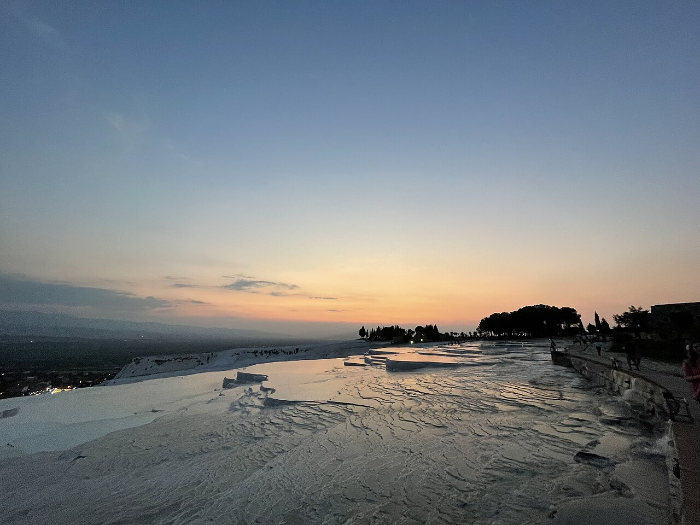

# 📍 Denizli - Seyahat ve Tefekkür Notları

## 📜 Şehrin Ruhu
> "Sabırla süzülen küçük ısrarlı su damlaları, asırlar içinde en sert ve karanlık kayaları bile bembeyaz bir pamuk tarlasına döndürür."
> "Yeraltından fokurdayarak fışkıran sıcağın sanata, antik zamanların ve gladyatörlerin ise derin bir sessizliğe dönüştüğü o eşsiz coğrafya."

### 🌍 Şehrin Dokusu ve Hatırası
Uzaktan pamuk tarlaları gibi görünen travertenlerin bembeyaz şefkati ve hemen yanı başındaki Hierapolis'in büyüleyici, devasa lahit kalıntıları. Toprağın altında kaynayan ve efsanelere konu olan şifalı sular, yeryüzüne çıktığında muazzam bir doğa heykeli inşa eder.

Denizli, tekstilin, dokumanın ve tabiatın en zarif işçiliğini birleştirerek yeryüzü tuvalinde sergilediği inanılmaz bir sanat atölyesi gibidir.

Laodikeia'da gezinirken İncil'de geçen yedi kiliseden birinde durduğunuzu farz ederken, antik havuzun içinde gladyatör sutunlarına dokunarak yüzmenin o olağanüstü mitolojik aurasına kapılabilirsiniz. Dokuma tezgahlarının o ritmik 'tık tık' sesleri, ezelden beri süre gelen bir bereketin kalp atışı gibidir.

### 🕊️ Gezginin Not Defterinden (İçsel Düşünceler)
Travertenleri adım adım, milim milim oluşturan o incecik damlalar bize sadece 'damlaya damlaya göl olur' demez; 'israr ederek, damlaya damlaya imkansız doğa mucizeleri yaratılır' der. Dünyadaki her büyük güzelliğin ardında asırlık sessiz bir sabır ve yavaş ama tükenmez bir gayret yatar.

Hierapolis'in o büyüleyici mezarlık alanı (Nekropol), ölümün bile bir sanat, bir saygı ve bir huzur sükuneti içinde ele alınabileceğini gösterir. Pamuk gibi bembeyaz kalkerlerin altında yatan o fokurdayan kırmızı termal sular, insanın en dingin dış görünüşünün ardında bile sönmeyen, tutkulu bir ateş barındırdığının nişanesidir.

### 🍽️ Yöresel Lezzet Tavsiyeleri
- **Denizli Kebabı (Fırın Kebabı):** Elle yenmesi adet olan, sakız odunu ateşinde taş fırınlarda pişen kuzu şöleni.
- **Zafer Gazozu:** Bölgenin retro ve popüler serinleticisi.
- **Yanık Yoğurt:** Bakır kazanlarda bilerek dibi tutturularak elde edilen özel isli lezzet.

### ⛺ Konaklama ve Bütçe Stratejisi
- **Sıfır Konaklama Maliyeti:** GSB Seyahatsever projesi kapsamında şehirdeki KYK yurtlarında 5 gün ücretsiz konaklanmıştır.
- **Ulaşım Optimizasyonu:** Bir önceki ilden rotaya devam edilerek yol masrafı minimize edilmiştir.

### 💻 Yarı Göçebe Mesaisi (Upskilling)
- **Kütüphane Rutini:** Gündüzleri İl Halk Kütüphanesinde zaman geçirilerek yazılım projeleri geliştirilmiş ve eğitimlere devam edilmiştir.
- **Şehri Sindirme:** Kalan vakitlerde şehrin tarihi ve kültürel dokusu acele etmeden, derinlemesine keşfedilmiştir.

### ✨ Keşfedilesi Duraklar
Bu şehrin havasını solumak, ruhuna dokunmak için mutlaka adımlanması gereken köşe taşları:
- [ ] **Pamukkale Travertenleri**
- [ ] **Hierapolis Antik Kenti ve Antik Havuz**
- [ ] **Laodikeia Antik Kenti**
- [ ] **Karahayıt Kırmızı Su Suları**
- [ ] **Teleferik ve Bağbaşı Yaylası**
- [ ] **Güney Şelalesi**

---
*Bu il bizzat deneyimlenmiş, yolları aşındırılmış ve seyahatnameye sevgiyle işlenmiştir.* ✅
