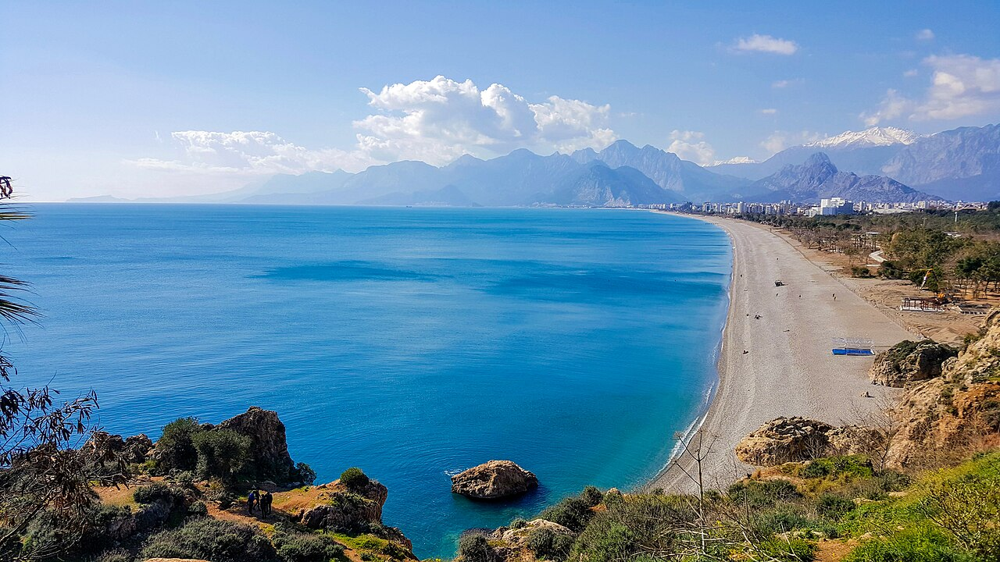

# 📍 Antalya - Seyahat ve Tefekkür Notları

## 📜 Şehrin Ruhu
> "Sonsuz maviliğin ufku, geçmişi derinliklerinde hatırlar ancak daima doğacak yeni güne daha büyük umutla bakar."
> "Kayalıklarına gürültüyle çarpıp geri çekilen suların, asırların mirasını şefkatle yıkadığı sıcak Akdeniz cenneti."

### 🌍 Şehrin Dokusu ve Hatırası
Akdeniz'in şüphesiz vitrini; güneşi, Likya ve Pamfilya antik kentlerini ve turkuaz doğayı cömertçe kucaklayan o sıcak coğrafya. Bir yanda Torosların kar kaplı heybeti dururken, diğer yanda insanın ruhunu yatıştıran engin mavi plajlar uzanır.

Kaleiçi'nin begonvillerle süslenmiş, dar ve nostaljik sokaklarında yürürken, antik krallıkların ayak seslerini ve yorgun kalyoncuların kalkanlara vuran mızrak seslerini bir film şeridi gibi hissedersiniz.

Aspendos'un o muazzam akustiğinde binlerce yıl önceki trajedilerin yankılandığını hayal edebilir, Kurşunlu ve Düden şelalelerinin ferahlığında cehennem sıcağından bir vaha serinliğine kaçabilirsiniz. Antalya sadece bir yaz rotası değil, derinlere inen kanyonları ve sedir ormanlarıyla başlı başına bir yaşam felsefesi mekanıdır.

### 🕊️ Gezginin Not Defterinden (İçsel Düşünceler)
Güneyin bu kızgın Akdeniz güneşi ve şifalı tatlı-tuzlu suyu, bedeni yorarken zihni tazeler. Karşınıza çıkan her amfi tiyatro ve kalıntı, geçmiş zamanın dünya telaşının ne denli boş olduğunu, asıl gerçeğin o anı en güzel şekilde yaşamak olduğunu fısıldar.

Torosların zirvelerinden Akdeniz'e karışan o coşkulu sular, aslında ruhun en yüksek zirvelerinden koptuktan sonra bedenin denizinde kayboluşunu ve en nihayetinde kaynağa, yani büyük sonsuzluğa geri dönüşünü simgeler.

### 🍽️ Yöresel Lezzet Tavsiyeleri
- **Piyaz (Antalya Usulü):** Tahinli, sirkeli sosuyla alışılagelmiş piyazları unutturan, kendi başına harika bir öğün.
- **Hibeş:** Tahin, sarımsak, limon ve baharatların harmanından doğan muazzam yerel meze.
- **Yanık Dondurma (Keçi Sütlü):** İsli, yanık kokulu ve sakızlı eşsiz bir serinletici.

### ⛺ Konaklama ve Bütçe Stratejisi
- **Sıfır Konaklama Maliyeti:** GSB Seyahatsever projesi kapsamında şehirdeki KYK yurtlarında 5 gün ücretsiz konaklanmıştır.
- **Ulaşım Optimizasyonu:** Bir önceki ilden rotaya devam edilerek yol masrafı minimize edilmiştir.

### 💻 Yarı Göçebe Mesaisi (Upskilling)
- **Kütüphane Rutini:** Gündüzleri İl Halk Kütüphanesinde zaman geçirilerek yazılım projeleri geliştirilmiş ve eğitimlere devam edilmiştir.
- **Şehri Sindirme:** Kalan vakitlerde şehrin tarihi ve kültürel dokusu acele etmeden, derinlemesine keşfedilmiştir.

### ✨ Keşfedilesi Duraklar
Bu şehrin havasını solumak, ruhuna dokunmak için mutlaka adımlanması gereken köşe taşları:
- [ ] **Tarihi Kaleiçi ve Yivli Minare**
- [ ] **Hadrian Kapısı (Üç Kapılar)**
- [ ] **Olympos ve Phaselis Antik Kentleri**
- [ ] **Düden ve Kurşunlu Şelaleleri**
- [ ] **Aspendos Antik Tiyatrosu**
- [ ] **Termessos Antik Kenti**

---
*Bu il bizzat deneyimlenmiş, yolları aşındırılmış ve seyahatnameye sevgiyle işlenmiştir.* ✅
