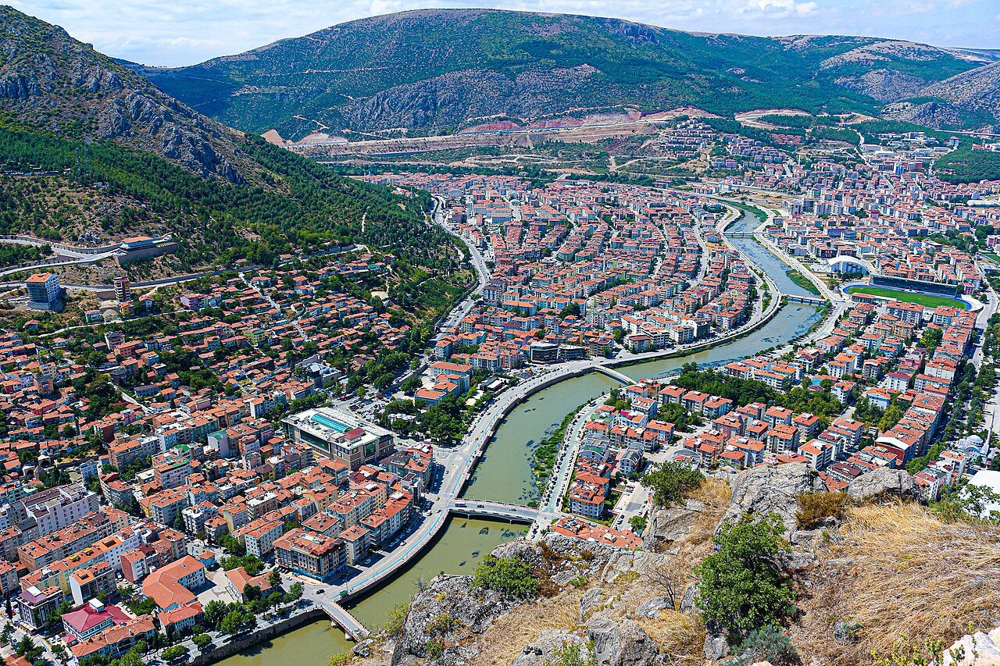

# 📍 Amasya - Seyahat ve Tefekkür Notları

## 📜 Şehrin Ruhu
> "Kayaya kazınan en büyük iz kralların gücü değil, vadiden usulca akan suların getirdiği yaşamdır."
> "Nehrin ikiye böldüğü, Ferhat'ın gölgesiyle dağların şarkısının rüzgarda birbirine karıştığı elma kokulu vadi."

### 🌍 Şehrin Dokusu ve Hatırası
Yeşilırmak'ın nazlı nazlı aktığı dar ve sarp bir vadiye gizlenmiş masal şehri. Nehrin iki yakasını süsleyen ince işçilikli yalıboyu evleri, onların üstüne heybetle yükselen hırçın kayalar ve bu kayalara kazınmış iki bin yıllık Pontus antik Kral Kaya mezarları...

Amasya, nehrin ritmiyle tarihin donup kaldığı bir seyir terasıdır. Şehzadelerin devlet yönetmeyi öğrendikleri bu topraklar, küçük yüzölçümüne rağmen kültürel olarak bir imparatorluk büyüklüğündedir.

Harşena Dağı'nın eteklerine serpiştirilmiş medreseler, köprüler ve camiler, sanki nehirle bir uyum anlaşması imzalamış gibidir. Geceleri Yeşilırmak'ın üzerine düşen o yumuşak yalı ışıkları, şehri adeta altın tozu serpilmiş efsunlu bir Ortaçağ masalına çevirir.

### 🕊️ Gezginin Not Defterinden (İçsel Düşünceler)
Bir dağın sinesine kibre kapılarak kazınmış o kocaman kral mezarları bile zamanın karşısında ufalanır; fakat o mütevazı görünümlü ırmak asırlardır hep aynı türküyü söyler. Amasya insana kalıcı olanın güç değil, doğanın akışına uyum sağlamak olduğunu öğretir.

Ferhat'ın Şirin için dağları deldiği bu sarp kayalıklar, mecazi aşkın nasıl ilahi bir gayrete ve sebatkarlığa dönüşebileceğini anlatır. Vadinin dar ve basık yapısı aslında bir sığınak gibi insanı dünyanın şerrinden uzaklaştırıp, kendi kalbinin en korunaklı köşesinde tefekküre daldırır.

### 🍽️ Yöresel Lezzet Tavsiyeleri
- **Amasya Çöreği:** Haşhaş ve cevizin odun ateşinde buluştuğu efsane lezzet.
- **Keşkek:** Özel günlerin ve bayramların büyük bakır kazanlarda dövülerek yapılan baştacı yemeği.
- **Misket Elması:** Sulu, kokulu ve şehrin simgesi olan enfes meyve.

### ⛺ Konaklama ve Bütçe Stratejisi
- **Sıfır Konaklama Maliyeti:** GSB Seyahatsever projesi kapsamında şehirdeki KYK yurtlarında 5 gün ücretsiz konaklanmıştır.
- **Ulaşım Optimizasyonu:** Bir önceki ilden rotaya devam edilerek yol masrafı minimize edilmiştir.

### 💻 Yarı Göçebe Mesaisi (Upskilling)
- **Kütüphane Rutini:** Gündüzleri İl Halk Kütüphanesinde zaman geçirilerek yazılım projeleri geliştirilmiş ve eğitimlere devam edilmiştir.
- **Şehri Sindirme:** Kalan vakitlerde şehrin tarihi ve kültürel dokusu acele etmeden, derinlemesine keşfedilmiştir.

### ✨ Keşfedilesi Duraklar
Bu şehrin havasını solumak, ruhuna dokunmak için mutlaka adımlanması gereken köşe taşları:
- [ ] **Kral Kaya Mezarları**
- [ ] **Amasya Kalesi**
- [ ] **Amasya Yalıboyu Evleri**
- [ ] **Hazeranlar Konağı**
- [ ] **Ferhat ile Şirin Aşıklar Müzesi**
- [ ] **II. Bayezid Külliyesi**
- [ ] **Sabuncuoğlu Şerefeddin Tıp Müzesi**

---
*Bu il bizzat deneyimlenmiş, yolları aşındırılmış ve seyahatnameye sevgiyle işlenmiştir.* ✅
