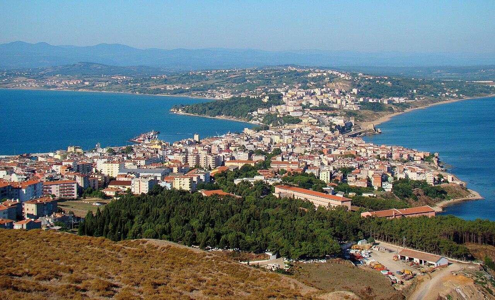

# 📍 Sinop - Seyahat ve Tefekkür Notları

## 📜 Şehrin Ruhu
> "En karanlık zindan kalın dört duvar arası ve demir parmaklıklar değil, insanın kendi kafasında ördüğü sınırlardır."
> "Hırçın Karadeniz ile huzurlu limanın buluştuğu, deniz kokulu yalnızlığıyla baş başa kalan filozof yarımada."

### 🌍 Şehrin Dokusu ve Hatırası
Gölgelerin, sükunetin ve en kuzeyin şehri. Anadolu'nun denize bir mızrak ucu gibi uzanan en uç noktası. Dalgaların yüzlerce yıllık kale duvarlarını dövdüğü, ormanın adeta denize döküldüğü ve insanın doğayla baş başa kaldığı efsanevi bir liman!

Dar sokaklarında deniz kokusu evlerin pencerelerinden içeri dolar. Hem inziva köşesi arayan bir bilge kadar huzurlu, hem de asırlık tarihi cezaevinin ürpertici havasını taşıyan acılı bir hafıza mekanıdır. Diogenes'in fenerle gündüz vakti insan aradığı bu topraklar, tefekkürün tam merkezidir.

Erfelek şelalelerinde ormanın içlerine doğru suyun peşinden giderken hissettiğiniz o gizem, İnceburun'un o rüzgarlı kayalıklarında yerini hudutsuz bir Sonsuzluk hissine bırakır. Sinop, coğrafyanın kader, doğanın ise bir öğretmen olduğunun en net tablosudur.

### 🕊️ Gezginin Not Defterinden (İçsel Düşünceler)
Tarihi cezaevinin nemli, ürpertici havası ve soğuk duvarları bize dışarıdaki özgürlüğün, bir nefes almanın değerini hatırlatırken; duvarın hemen dibindeki uçsuz bucaksız deniz, insanın kalbindeki sınır tanımaz umudu ve sonsuzluk tutkusunu temsil eder.

Düşünceleri, duyguları yahut bedeni hapsedeceklerini sananların, insanın ruhundaki o uçsuz bucaksız maviliği asla demir parmaklıklar ardına koyamayacağı bu şehirde daha iyi anlaşılır. Fırtına ne kadar sert eserse essin, dalgalar ne kadar yükselirse yükselsin, içimizdeki sükunet limanı hep oradadır.

### 🍽️ Yöresel Lezzet Tavsiyeleri
- **Sinop Mantısı (Cevizli Mantı):** Yarısı yoğurtlu, yarısı bol cevizli olarak sunulan sıradışı bir hamur işi vizyonu.
- **Nokul:** Üzümlü ve cevizli, çay saatlerinin başrol oyuncusu, kıyır kıyır bir yöresel börek/çörek.
- **Taze Karadeniz Balıkları:** Özellikle kış aylarında İnceburun açıklarından tutulan hamsi ve istavrit.

### ⛺ Konaklama ve Bütçe Stratejisi
- **Sıfır Konaklama Maliyeti:** GSB Seyahatsever projesi kapsamında şehirdeki KYK yurtlarında 5 gün ücretsiz konaklanmıştır.
- **Ulaşım Optimizasyonu:** Bir önceki ilden rotaya devam edilerek yol masrafı minimize edilmiştir.

### 💻 Yarı Göçebe Mesaisi (Upskilling)
- **Kütüphane Rutini:** Gündüzleri İl Halk Kütüphanesinde zaman geçirilerek yazılım projeleri geliştirilmiş ve eğitimlere devam edilmiştir.
- **Şehri Sindirme:** Kalan vakitlerde şehrin tarihi ve kültürel dokusu acele etmeden, derinlemesine keşfedilmiştir.

### ✨ Keşfedilesi Duraklar
Bu şehrin havasını solumak, ruhuna dokunmak için mutlaka adımlanması gereken köşe taşları:
- [ ] **Tarihi Sinop Cezaevi**
- [ ] **Sinop Kalesi**
- [ ] **Hamsilos Tabiat Parkı**
- [ ] **Erfelek Tatlıca Şelaleleri**
- [ ] **İnceburun Deniz Feneri**
- [ ] **Diyojen Heykeli**

---
*Bu il bizzat deneyimlenmiş, yolları aşındırılmış ve seyahatnameye sevgiyle işlenmiştir.* ✅
